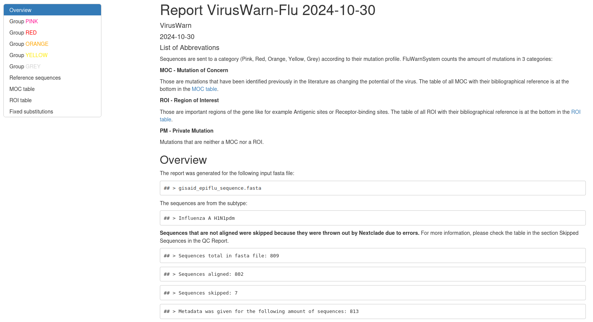
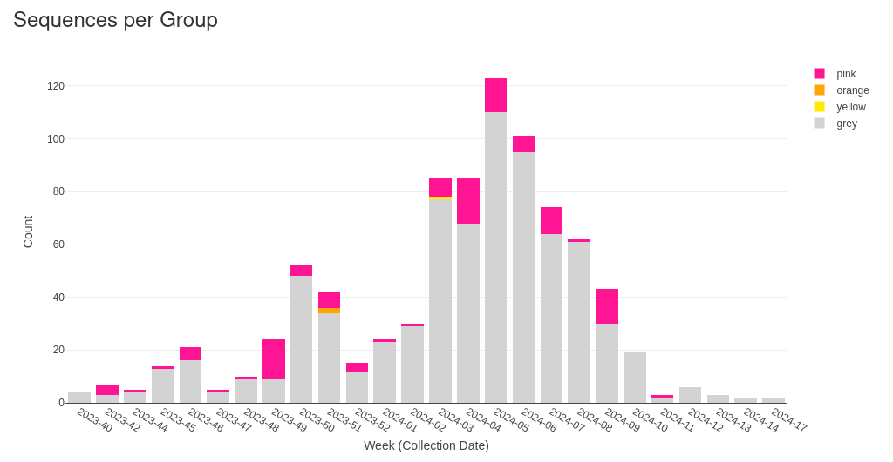
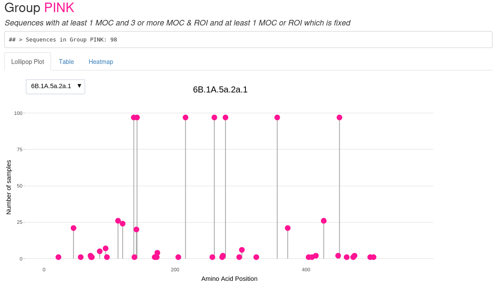
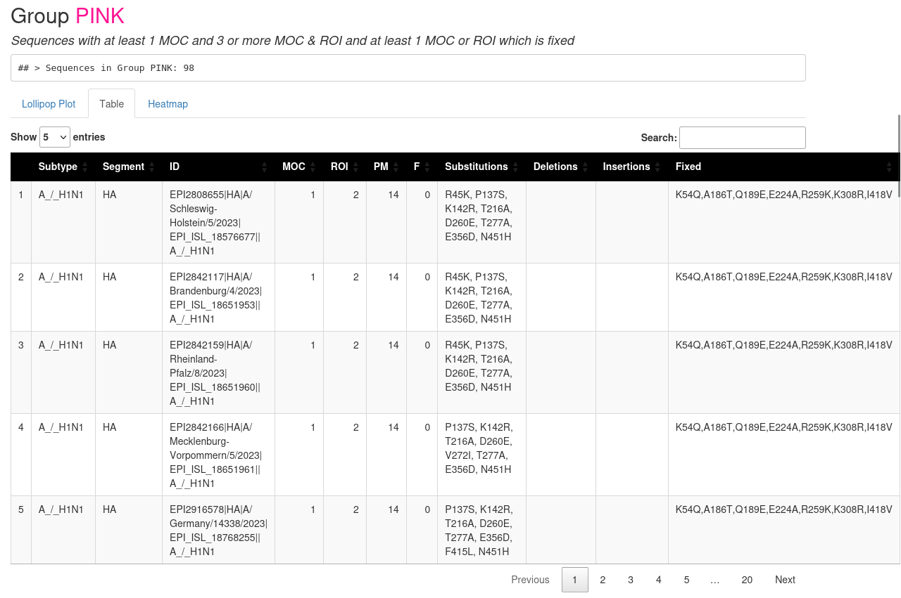
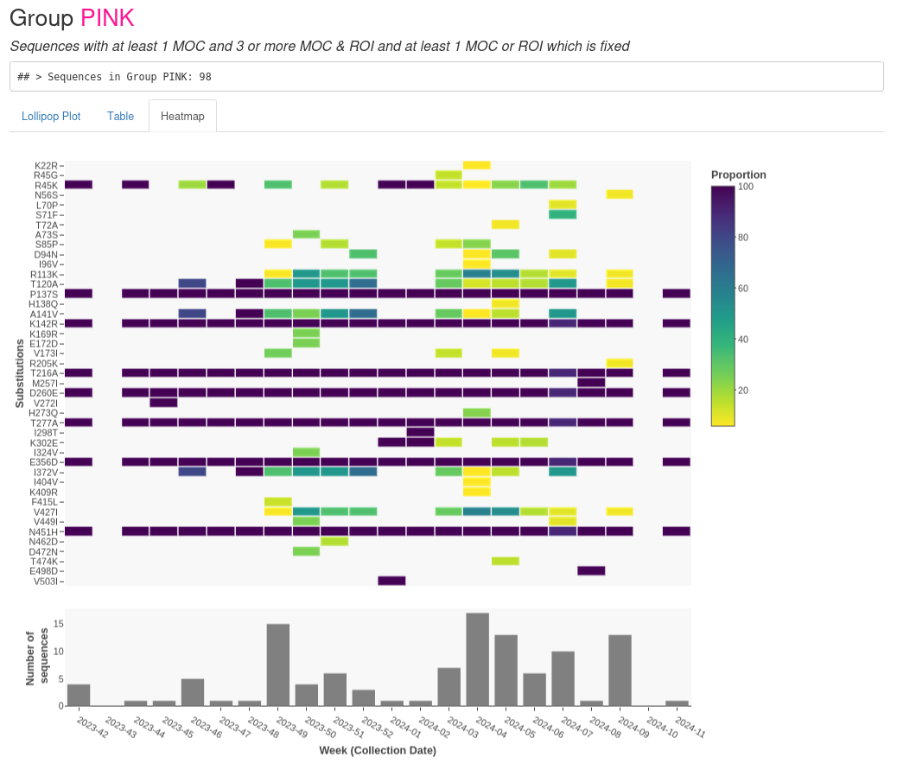
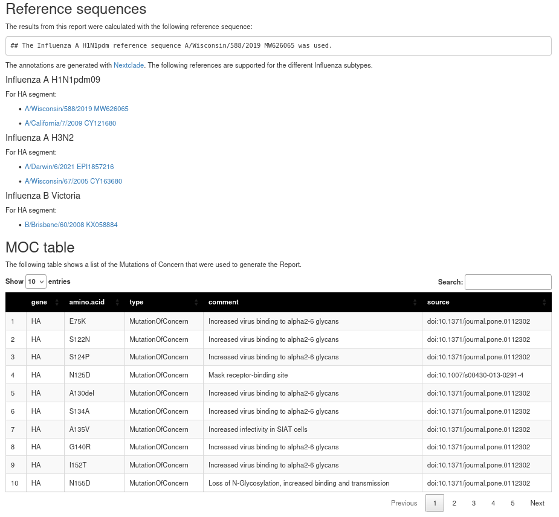

## Example Report

This folder includes an example report generated from data downloaded from GISAID with the following filters on 2024-10-16:

| Filter                  | Value           |
|:------------------------|----------------:|
| **Type**                | A               |
| **H**                   | 1               |
| **N**                   | 1               |
| **Location**            | Europe Germany  |
| **Collection Date From**| 2023-10-01      |
| **Collection Date To**  | 2024-05-31      |
| **Required segments**   | HA              |
| **only complete**       | Yes             |

The ID, Originating Laboratory and Submitting Laboratory of the sequences used for the report are listed in the *gisaid_acknowledge_table.xls*.

**We gratefully acknowledge all data contributors, i.e., the Authors and their Originating laboratories responsible for obtaining the specimens, and their Submitting laboratories for generating the genetic sequence and metadata and sharing via the GISAID Initiative, on which this research is based.**

## Screenshots

As GitHub does not show HTML files, you can find also some screenshots of the reports in the subfolder [`screenshots`](screenshots/).
All of the plots in the report are interactive so it is definitely worth it to download the report or build one yourself to check out everything!

You can find the report overview ...

... the barplot which gives an overview how many samples from each week are placed in which level ...

... the lollipop plot from the pink level showing how many mutations occur at which position of the HA segment ...

... the searchable table of the pink level ...

... the heatmap of the pink level that shows if substitutions accumulated over the weeks ...

... and the overview of the data used to generate the results (there is also a section for Regions of Interest and Fixed Mutations, which is not captured in the picture).

